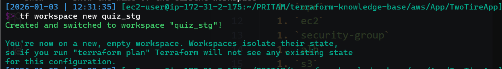
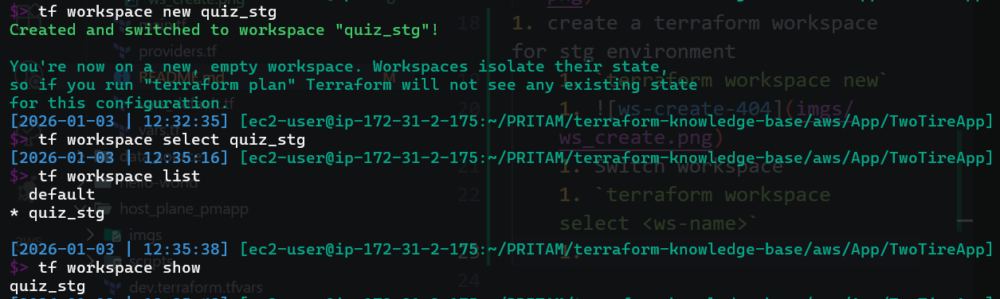
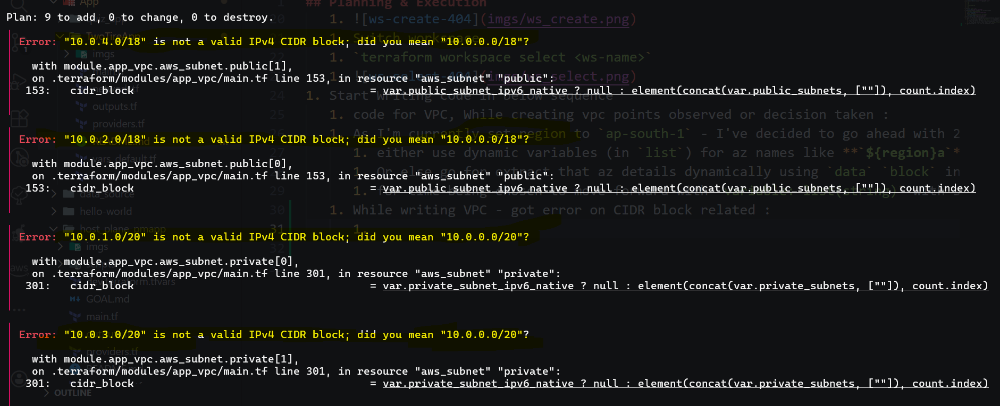
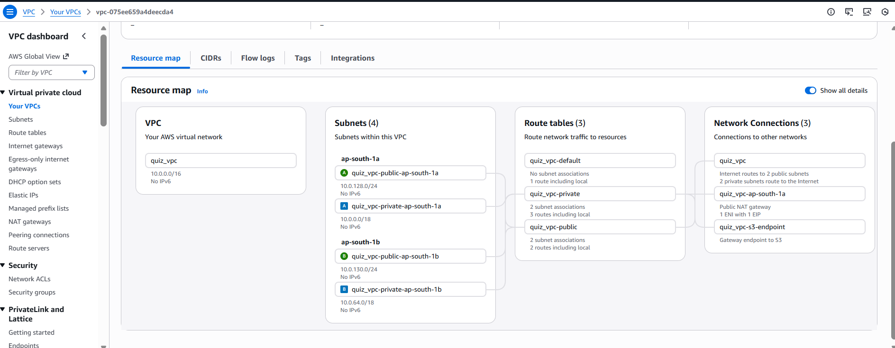
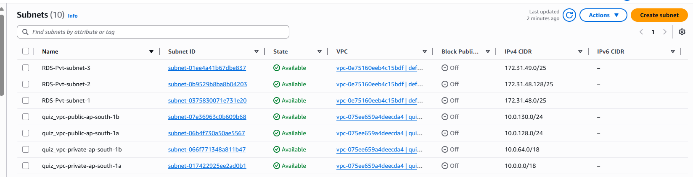
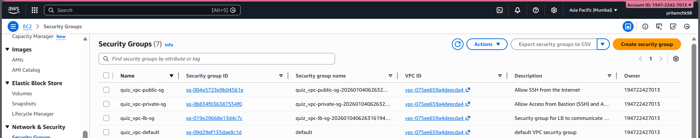
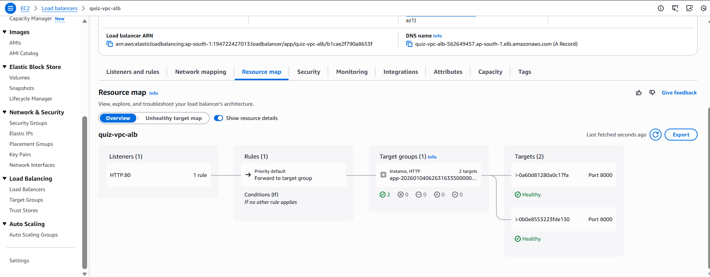
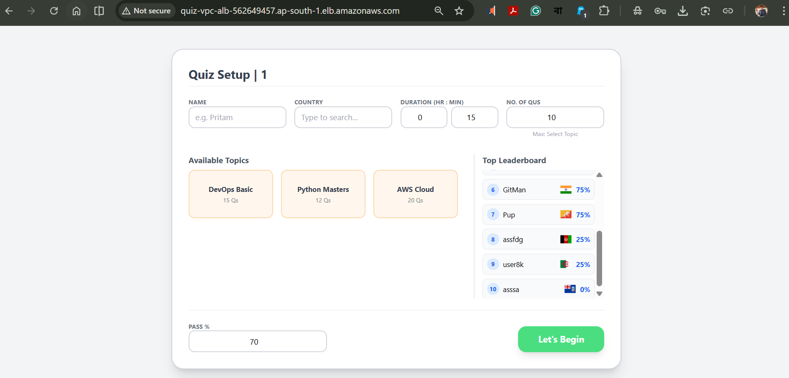

## Planning & Execution

1. Creating base file structure for provider aws
1. Setting Variables
1. Decided to use terraform available modules from Terraform registry
   1. [IAM Module Link 404](https://registry.terraform.io/modules/terraform-aws-modules/iam/aws/latest)
1. Designed architecture diagram in `erase.io`
   1. 
1. List the terraform modules I'm going to use:
   1. `iam`
   1. `vpc`
   1. `ec2`
   1. `security-group`
   1. `alb`
   1. `s3`
1. Terraform `init` o/p:
   1. 
1. create a terraform workspace for stg environment
   1. `terraform workspace new`
   1. 
   1. Switch workspace
   1. `terraform workspace select <ws-name>`
   1. 
1. Start Writing code in below sequence

   1. code for VPC, While creating vpc points observed or decision taken :
   1. As I'm currently set region to `ap-south-1` - I've decided to go ahead with 2 **`availability zones`** - here Idea is
      1. either use dynamic variables (in `list`) for az names like **`${region}a`** and **`${region}b`**
      1. Or else go for extract that az details dynamically using `data` `block` in `terraform`
      1. for time being chosen to move forward with `variable: list(string)` with string interpolation strategy.
   1. While writing VPC - got error on CIDR block related :

      1. 
      1. understood the CIDR range and cidr math properly and changed the code accordingly.
      1. Created `terraform plan` for VPC and that time while analyzing I've understood again I did a mistake of CIDR block overlapping for `private` and `public` subnet

      1. > ⚠️ Critical Warning: CIDR Overlap Detected Before you run terraform apply, you must fix a conflict in your IP ranges. Private Subnet 0 tries to take: 10.0.0.0/18 (IPs 10.0.0.0 to 10.0.63.255). Public Subnet 0 tries to take: 10.0.0.0/24 (IPs 10.0.0.0 to 10.0.0.255). The Problem: The Public Subnet is inside the Private Subnet. AWS will reject this because two subnets cannot share the same IP addresses. The Fix: Change the Private Subnet CIDRs to start after the public ones, or use non-overlapping ranges (e.g., Private starts at 10.0.128.0/18).

   1. Started working on the Security groups next using [**Security-group-module**](https://registry.terraform.io/modules/terraform-aws-modules/security-group/aws/latest)
      1. I need 2 sg , 1 for load balancer, 1 for ec2-instances
      1. as usual expected : got error :
         - > `The given value is not suitable for module.ec2_sg_quiz_vpc.var.ingress_with_cidr_blocks declared at .terraform/modules/ec2_sg_quiz_vpc/variables.tf:85,1-36: element 0: element "cidr_blocks": string required, but have list of string.`
         - > `Error: invalid value for name_prefix (cannot begin with sg-) with module.ec2_sg_quiz_vpc.aws_security_group.this_name_prefix[0], on .terraform/modules/ec2_sg_quiz_vpc/main.tf line 40, in resource "aws_security_group" "this_name_prefix":│   40:   name_prefix            = "${var.name}-"`
      1. Fixed by changing name `sg-*` to `*-sg` and used `join(",",list_var)` to convert output a string [of , separated cidr values]
   1. Next Target on the VPC endpoint
      1. Creation code successful but then facing challenge to setup proper sg rule to give connection
      1. got to know the concept of **`aws_prefix_list`**
      1. > tf
         > #1. Get the "ID Card" for AWS S3
         > data "aws_prefix_list" "s3" {
         > name = "com.amazonaws.${var.region}.s3"
         > }
   1. added rule to access the `s3` in `ec2-sg`
   1. Created one more `sg` for `public subnet` access related for `EC2`.
   1. Last use `ec2-module` to create `EC2` instances in both `private subnet`.
      1. 2 instance: for 2 different private vpc.
      1. 1 instance: for `ssh` to private ip's of those `private subnet` `VMs`

1. `terraform plan` successful
1. `terraform apply` successful
1. connect to : `ssh -i /home/ec2-user/.ssh/aws-k3s-key.pem ec2-user@3.109.32.87`
1. found other details:
   1. > alb_dns_name = "quiz-vpc-alb-447588094.ap-south-1.elb.amazonaws.com"
      > app_private_ips = [
      >
      > > "10.0.62.176",
      > > "10.0.115.184",
      > > ]
      > > bastion_public_ip = "3.109.32.87"

---

## Encountered some issue after above setup | Also the resolution:

1. Encountered Logic Error during terraform apply:

   1. Tried to provision the server using `remote-exec` inside the `aws_instance` block.
   1. **Issue**: Error: Cycle: `aws_instance.app_servers`...
   1. **Reason**: The provisioner needed the host IP to run, but Terraform couldn't generate the IP until the instance was created. It was a "Chicken and Egg" problem.
   1. **`Fix`**: Switched from remote-exec to user_data.

      - This moves the installation logic to the AWS boot process (cloud-init) instead of running it from my local Terraform.
        > sh
        > user_data = <<-EOF
        > #!/bin/bash
        > dnf update -y
        > dnf install git unzip python3-pip -y
        > EOF

   1. Debugging Network Issues (The "504 Gateway Timeout"):

      1. App was deployed, but ALB URL returned 504 Gateway Timeout or 502 Bad Gateway.
      1. Investigation:
         - Found a "Double Mismatch" in Security Groups.
         - `Mismatch 1` (Port): App was running on port 8000 (uvicorn default), but Security Group only allowed 8080.
         - `Mismatch 2` (Source): Private SG allowed traffic from Bastion, but blocked traffic from the Load Balancer
         - `Mismatch 3` (Egress): The ALB Security Group had Ingress (Allow In) but missing Egress (Allow Out). The request was getting trapped in the ALB
      1. **Fix:**

      - > Added egress { from_port = 0, to_port = 0, protocol = "-1", cidr_blocks = ["0.0.0.0/0"] } to ALB SG.
      - Updated Private SG to allow port `8000` specifically from `module.load_balancer.security_group_id`.

   1. Solving Identity Issues (IAM):

   - App started successfully but crashed immediately when trying to list S3 buckets.
   - Error: `Error: Unable to locate credentials`
   - **Reason**: The EC2 instances had no permissions to talk to AWS APIs.
   - Fix: Created a new `iam.tf` file.
   - Created a `aws_iam_role` with `S3` access.
   - Created a `aws_iam_instance_profile` to hold the role.
   - Attached the profile to `aws_instance.app_servers`.
   - **Now the app authenticates automatically without hardcoded keys**.

1. Final Manual Deployment & Persistence:

   - Since user_data only installs dependencies, I had to start the app manually.
   - Used SSH Jump to reach private IP via Bastion:
   - > `ssh -i <pem-file-path> ec2-user@<BASTION_IP> ec2-user@<PRIVATE_IP>`
   - Repeated this step for BOTH private servers to ensure High Availability.

1. Final Verification:

- Checked Target Group Health in AWS Console -> Healthy ✅
- Accessed ALB DNS Name -> App Loaded ✅
- Estimated Cost calculated for this infra: approx `$0.12/hr` (Mainly due to NAT Gateway).

---

### Screenshots from AWS console

> 1. vpc
>    
> 1. subnets
>    
> 1. Security groups
>    
> 1. EC2 Instances
>    
> 1. ALB setup
>    
> 1. Hosted App
>    
