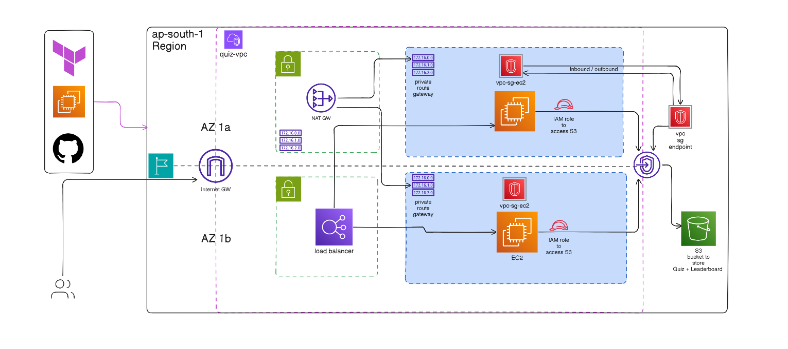
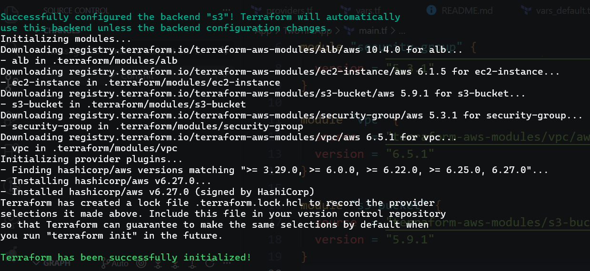

## Planning

1. Creating base file structure for provider aws
1. Setting Variables
1. Decided to use terraform available modules from Terraform registry
   1. [IAM Module Link 404](https://registry.terraform.io/modules/terraform-aws-modules/iam/aws/latest)
1. Designed architecture diagram in `erase.io`
   1. 
1. List the terraform modules I'm going to use:
   1. `iam`
   1. `vpc`
   1. `ec2`
   1. `security-group`
   1. `alb`
   1. `s3`
1. Terraform `init` o/p:
   1. 
