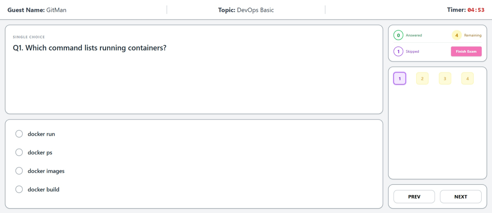
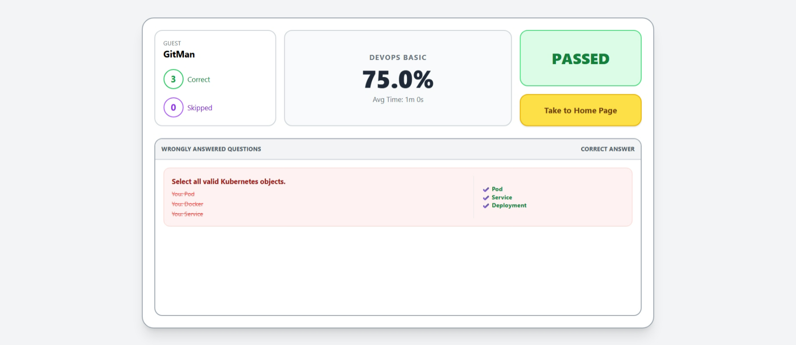

Here is a professional `README.md` file for your project. You can save this as `README.md` in the root of your `quiz_app` folder.

## Excalidraw Design for Base Creation


## Final Output
>1. Landing Page
>
>1. Quiz Interface
>
>1. Result Analysis
>  


# Generic Quiz Platform 🚀

A lightweight, dynamic, and responsive Quiz Application built with **FastAPI** (Backend) and **Vanilla JS + Tailwind CSS** (Frontend). Designed for flexibility, it supports randomized questions, persistent leaderboards, and detailed result analysis.

## 🌟 Features

### 🔹 Core Functionality

- **Dynamic Topics:** Load questions from JSON files. Easily add new topics by dropping a `.json` file into the `data/topics` folder.
- **Configurable Exam:** Users can set their name, country (with flag search), exam duration, number of questions, and pass percentage.
- **Question Types:** Supports both **Single Choice (Radio)** and **Multiple Select (Checkbox)** questions.
- **Randomization:** Questions are shuffled every time a quiz starts to ensure fairness.

### 🔹 User Interface

- **Responsive Design:** Mobile-friendly split-screen layout using **Tailwind CSS**.
- **Interactive Timer:** Real-time countdown (HH:MM:SS) that auto-submits the exam when time expires.
- **Navigation:** "Next", "Prev", and "Jump-to-Question" grid for easy review.
- **Visual Feedback:** Color-coded grid showing Answered, Skipped, and Current status.

### 🔹 Analytics & Persistence

- **Live Leaderboard:** Tracks top scores. Data is saved to a local JSON file (`leaderboard.json`), so it survives server restarts.
- **Detailed Results:** Post-exam analysis showing score, time taken, pass/fail status, and a detailed breakdown of **wrong answers** with correct solutions.

---

## 🛠️ Tech Stack

- **Backend:** Python 3.9+, FastAPI, Uvicorn
- **Templating:** Jinja2
- **Frontend:** HTML5, Tailwind CSS (via CDN), Vanilla JavaScript
- **Data Storage:** JSON (File-based)

---

## 📂 Project Structure

```text
quiz_app/
├── main.py                 # Application entry point & route logic
├── requirements.txt        # Python dependencies
├── data/
│   ├── leaderboard.json    # Persistent storage for top scores
│   ├── topics_index.json   # Metadata for available topics (ID, Name, Description)
│   └── topics/             # Folder containing question sets
│       ├── devops.json
│       ├── python.json
│       └── aws.json
├── templates/
│   ├── index.html          # Landing Page (Setup & Leaderboard)
│   ├── quiz.html           # Main Quiz Interface
│   └── result.html         # Scorecard & Analysis
└── static/                 # Static assets (images/css if needed)

```

---

## 🚀 Getting Started

### 1. Prerequisites

Ensure you have Python installed.

```bash
python --version
# Should be Python 3.7+

```

### 2. Installation

Clone the repository and install dependencies.

```bash
git clone <repository-url>
cd quiz_app

# It is recommended to use a virtual environment
python -m venv venv
source venv/bin/activate  # On Windows: venv\Scripts\activate

# Install required packages
pip install -r requirements.txt

```

### 3. Setup Data

Initialize the leaderboard file to prevent startup errors:

```bash
mkdir -p data/topics
echo "[]" > data/leaderboard.json

```

_(Note: Ensure you have valid topic JSON files in `data/topics/` matched with `data/topics_index.json`)_

### 4. Run the Application

Start the development server:

```bash
uvicorn main:app --host 0.0.0.0 --port 8000 --reload

```

### 5. Access

Open your browser and navigate to:
`http://localhost:8000`

---

## 📝 Adding New Quizzes

To add a new topic (e.g., "Java"):

1. **Create the Question File:**
   Create `data/topics/java.json`:

```json
[
  {
    "id": 1,
    "type": "single",
    "text": "What is the size of int in Java?",
    "options": ["16 bit", "32 bit", "64 bit", "8 bit"],
    "correct": [1]
  }
]
```

2. **Register the Topic:**
   Add entry to `data/topics_index.json`:

```json
{
  "id": "java",
  "name": "Java Basics",
  "description": "Core Java concepts",
  "question_count": 1
}
```

---

## 📸 Screenshots

| Landing Page          | Quiz Interface            | Results Analysis |
| --------------------- | ------------------------- | ---------------- |
| _Setup & Leaderboard_ | _Split layout with Timer_ | _Score & Review_ |

---

## 🤝 Contributing

1. Fork the Project
2. Create your Feature Branch (`git checkout -b feature/AmazingFeature`)
3. Commit your Changes (`git commit -m 'Add some AmazingFeature'`)
4. Push to the Branch (`git push origin feature/AmazingFeature`)
5. Open a Pull Request
