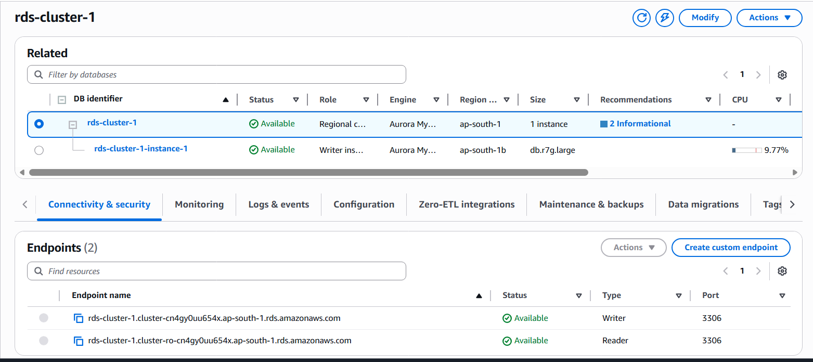

## Amazon RDS Creation Manually :

---

> [!NOTE]
> Offical Doc Link to Read on RDS provisioning for learning : [Click Here](https://docs.aws.amazon.com/AmazonRDS/latest/gettingstartedguide/create-instance-overview.html#create-instance)

> 

> Post RDS Creation : connect and verify from a EC2 instance

```bash
#End Point Name : ## rds-cluster-1.cluster-cn4gy0uu654x.ap-south-1.rds.amazonaws.com

#admin

aws secretsmanager get-secret-value \
  --secret-id "rds\!cluster-2593c2fc-93b6-4650-8a9e-7503902747be" \
  --query SecretString \
  --output text

aws secretsmanager get-secret-value   --secret-id 'rds!cluster-2593c2fc-93b6-4650-8a9e-7503902747be'   --query SecretString   --output text
{"username":"admin","password":"m.f5oV(V:!*M3dxw.yW5DA]G3fk7"}

mysql -h rds-cluster-1.cluster-cn4gy0uu654x.ap-south-1.rds.amazonaws.com   -u admin   -p < Prompt For password >
```

