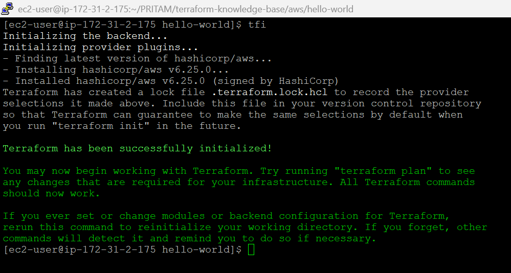
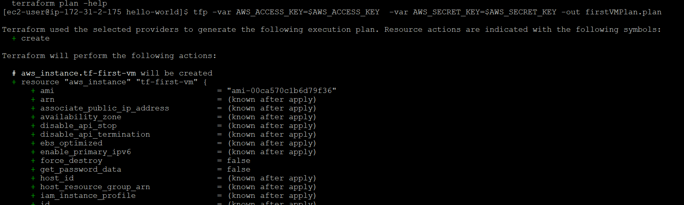
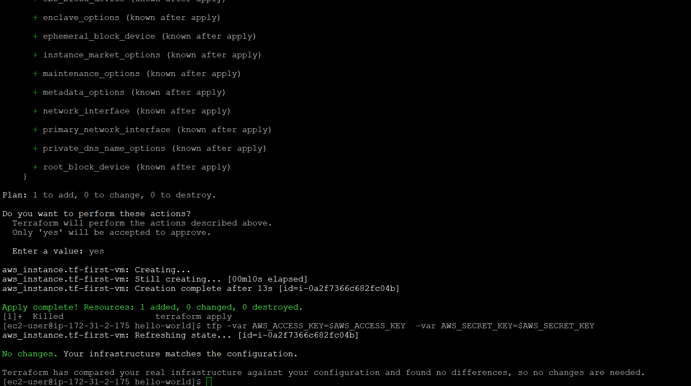
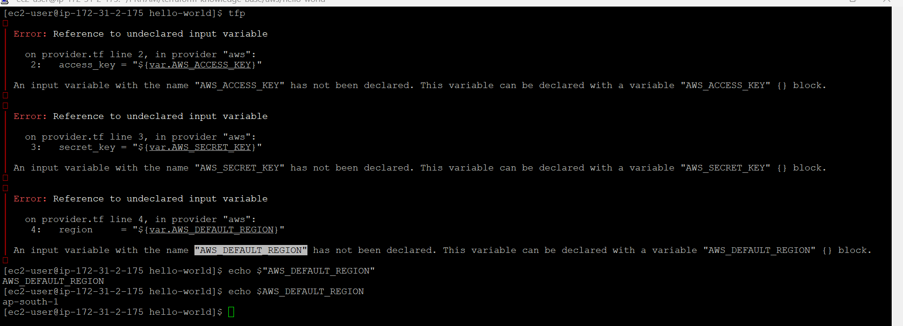
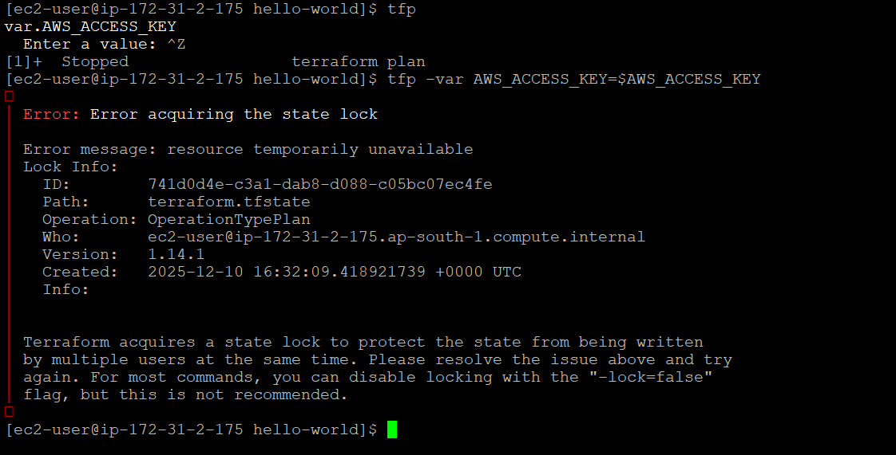

# Terraform Hello World Example

## Overview

This is a basic Terraform example that creates an AWS S3 bucket.

## Prerequisites & Configuration

- Terraform installed
- AWS account configured with credentials --> `terraform-group` created and `AdminAccess` Policy attached --> `terraform-user` created and added to group `terraform-group`
- provider related creds set in `.aws_secret` - dir and read in `.bash_profile` to set `environment vars`
- `main.tf` and `provider.tf` - created and pushed in git
- initiated terraform command

## Output from EC2-Server

> ```shell
> terraform init
> ```
>
> 
>
> ```shell
> terraform plan -var AWS_ACCESS_KEY=$AWS_ACCESS_KEY  -var AWS_SECRET_KEY=$AWS_SECRET_KEY
> ```
>
> 
>
> ```shell
> terraform apply -var AWS_ACCESS_KEY=$AWS_ACCESS_KEY  -var AWS_SECRET_KEY=$AWS_SECRET_KEY
> ```
>
> 

## Usage

```bash
# Initialize Terraform
terraform init

# Preview changes
terraform -var AWS_ACCESS_KEY=$AWS_ACCESS_KEY  -var AWS_SECRET_KEY=$AWS_SECRET_KEY

# Apply configuration
terraform apply

# Destroy resources
terraform destroy
```

## Errors Faced

> 1. 
>
> 1. olution:
