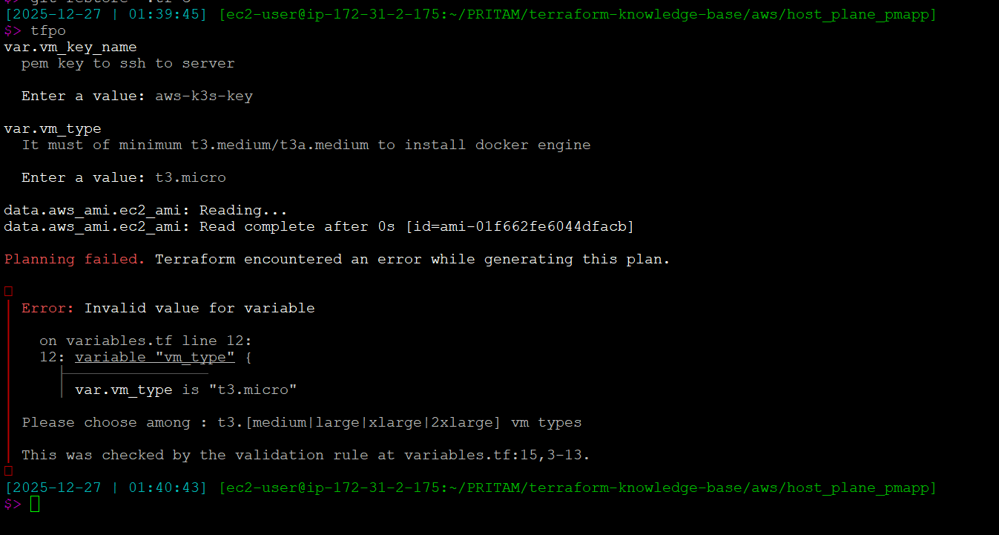
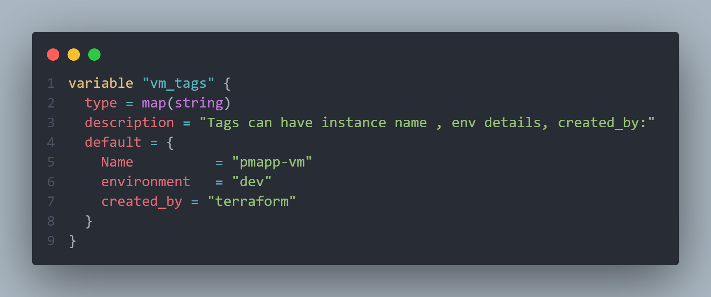
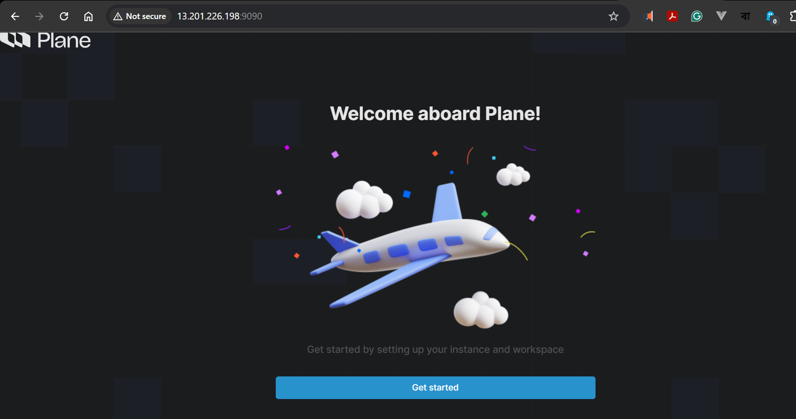
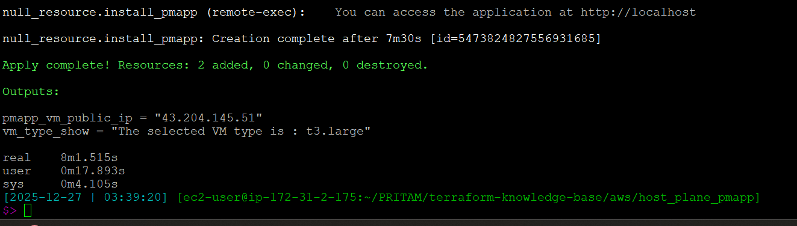

### What Learnings I'm using here

- Learning of data source aws_ami --> fetch details of latest ami for aws 2023 linux

- S3 backend setup for terraform

- EC2 Provisioning using life-cycle like prevent destroy for the VM
- Validation for variable
  - 
- Validation for All TF Files

  > First Validation:
  >
  > 

- Setup a docker containerized app through script provisioning

link : [Reference to HCL Doc](https://developer.hashicorp.com/packer/docs/templates/hcl_templates/blocks/build/provisioner)

- All TF file formatting

> Before Formatting
> 

> After Formatting
> 
>
> 

- terraform workspace for environment specific
  - 
  - 
- Complex Variable Tag
  - 
- Issue faced with docker compose installation and check
- Finally app is up
  - 
  - 
