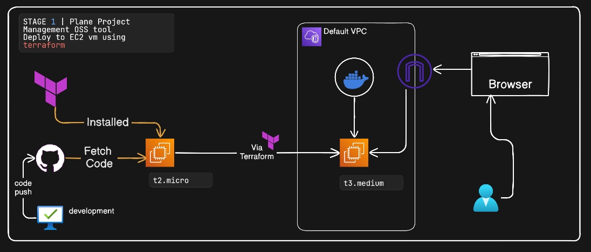
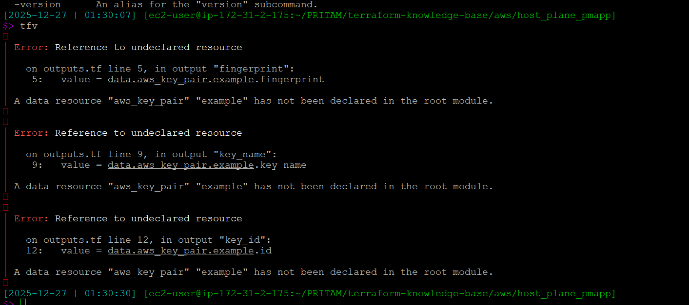
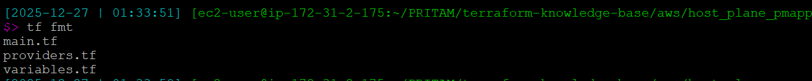
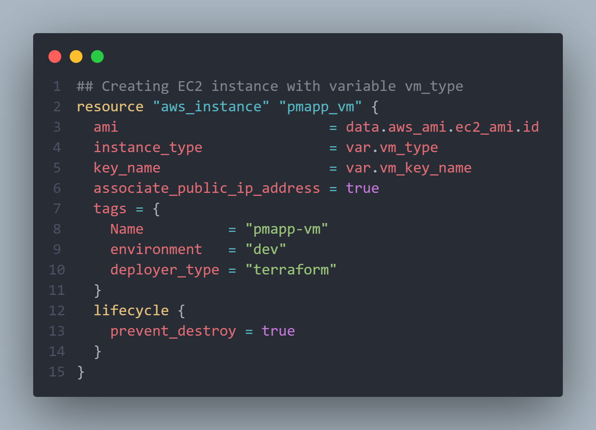
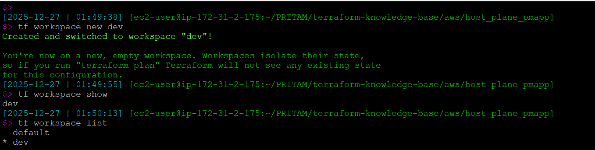
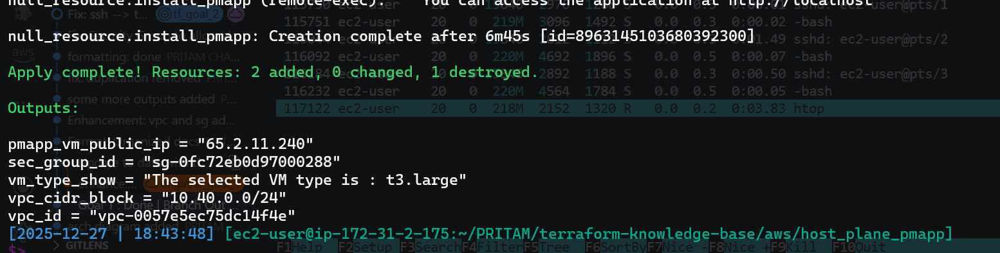
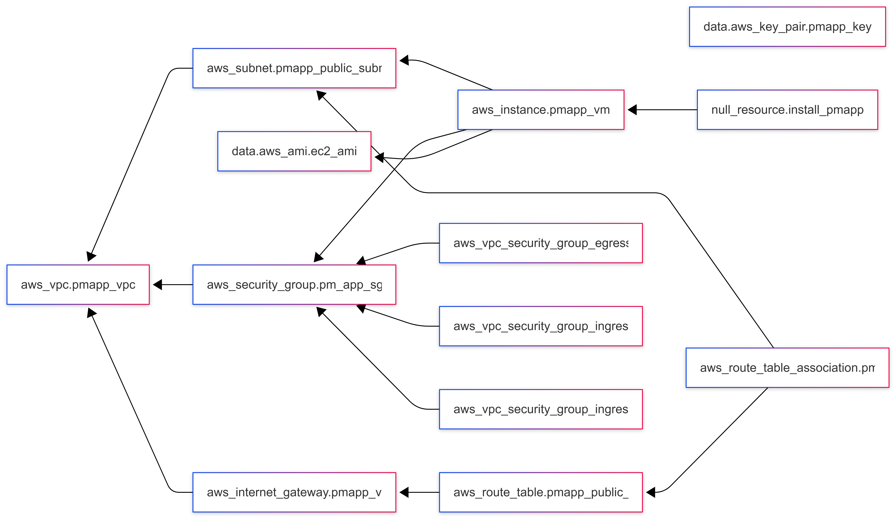

## Goal 1: Deploy a dockerized application to a EC2 instance using `Terraform`

---

> Architecture I'm trying to achieve here:
>
> 

### Key learnings in Goal 1

---

- Learning of data source aws_ami --> fetch details of latest ami for aws 2023 linux

- S3 backend setup for terraform

- EC2 Provisioning using life-cycle like prevent destroy for the VM
- Validation for variable
  - 
- Validation for All TF Files

  > First Validation:
  >
  > 

- Setup a docker containerized app through script provisioning

link : [Reference to HCL Doc](https://developer.hashicorp.com/packer/docs/templates/hcl_templates/blocks/build/provisioner)

- All TF file formatting

> Before Formatting
> 

> After Formatting
> 
>
> 

- terraform workspace for environment specific
  - 
  - 
- Complex Variable Tag
  - 
- Issue faced with docker compose installation and check
- Finally app is up
  - 
  - 

---

## Goal 2: Implement same with Custom `VPC`

> **`Architecture Diagram`** :
>
> 

> - Create New VPC using `terraform`
> - Create **Security Group** using `terraform` and allow only `port` `80` and `22` for `ssh`
> - Provision the EC2 inside the public subnet with
>   make module of EC2 and VPC

---

### Key learnings in Goal 2 :

1. **1st** thing I'm working on is the VPC
    - Added vpc code first into `vpc.tf` file
    - then tried to follow documentation to create the subnet -> `aws_subnet` 
    - created `route table` and `internet gateway` and learnt how to associate these 2 to the created `subnet` 
1. **2nd** thing I'm working on is the Security group
   1. This is at EC2 Level
   - `#` of `Inbound Rule` - 2
     - `ssh 22`
     - `port 80` - Incoming traffics
   - `#` of `Outbound Rules` - Allow all
   1. So now first find out `Terraform code` from `doc` for creating `sg`
      - [Doc Link for : `vpc_security_group`](https://registry.terraform.io/providers/hashicorp/aws/latest/docs/resources/security_group)
   1. **Challenges Faced**:
      - First time validation of code failed
      - terraform apply got stuck at provisioning stage where `issue` was with the `cidr_ipv4` wrong value given in security group which was not allowing the provision connection.
      - `ssh` port allowed - was missing


#### Final Outcome

- 

- Generated graph image from terraform:
- 
```marmaid
digraph G {
  rankdir = "RL";
  node [shape = rect, fontname = "sans-serif"];
  "data.aws_ami.ec2_ami" [label="data.aws_ami.ec2_ami"];
  "data.aws_key_pair.pmapp_key" [label="data.aws_key_pair.pmapp_key"];
  "aws_instance.pmapp_vm" [label="aws_instance.pmapp_vm"];
  "aws_internet_gateway.pmapp_vpc_igw" [label="aws_internet_gateway.pmapp_vpc_igw"];
  "aws_route_table.pmapp_public_rt" [label="aws_route_table.pmapp_public_rt"];
  "aws_route_table_association.pmapp_public_rt_assoc_1a" [label="aws_route_table_association.pmapp_public_rt_assoc_1a"];
  "aws_security_group.pm_app_sg" [label="aws_security_group.pm_app_sg"];
  "aws_subnet.pmapp_public_subnet_1a" [label="aws_subnet.pmapp_public_subnet_1a"];
  "aws_vpc.pmapp_vpc" [label="aws_vpc.pmapp_vpc"];
  "aws_vpc_security_group_egress_rule.allow_all_traffic_ipv4" [label="aws_vpc_security_group_egress_rule.allow_all_traffic_ipv4"];
  "aws_vpc_security_group_ingress_rule.pm_app_sg_ipv4" [label="aws_vpc_security_group_ingress_rule.pm_app_sg_ipv4"];
  "aws_vpc_security_group_ingress_rule.pm_app_sg_ssh" [label="aws_vpc_security_group_ingress_rule.pm_app_sg_ssh"];
  "null_resource.install_pmapp" [label="null_resource.install_pmapp"];
  "aws_instance.pmapp_vm" -> "data.aws_ami.ec2_ami";
  "aws_instance.pmapp_vm" -> "aws_security_group.pm_app_sg";
  "aws_instance.pmapp_vm" -> "aws_subnet.pmapp_public_subnet_1a";
  "aws_internet_gateway.pmapp_vpc_igw" -> "aws_vpc.pmapp_vpc";
  "aws_route_table.pmapp_public_rt" -> "aws_internet_gateway.pmapp_vpc_igw";
  "aws_route_table_association.pmapp_public_rt_assoc_1a" -> "aws_route_table.pmapp_public_rt";
  "aws_route_table_association.pmapp_public_rt_assoc_1a" -> "aws_subnet.pmapp_public_subnet_1a";
  "aws_security_group.pm_app_sg" -> "aws_vpc.pmapp_vpc";
  "aws_subnet.pmapp_public_subnet_1a" -> "aws_vpc.pmapp_vpc";
  "aws_vpc_security_group_egress_rule.allow_all_traffic_ipv4" -> "aws_security_group.pm_app_sg";
  "aws_vpc_security_group_ingress_rule.pm_app_sg_ipv4" -> "aws_security_group.pm_app_sg";
  "aws_vpc_security_group_ingress_rule.pm_app_sg_ssh" -> "aws_security_group.pm_app_sg";
  "null_resource.install_pmapp" -> "aws_instance.pmapp_vm";
}
```
---