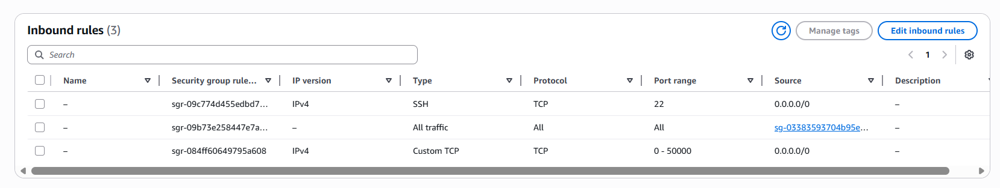
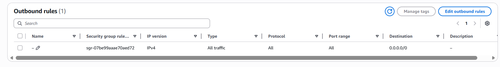

# Terraform AWS K3s Cluster

This Terraform module deploys a lightweight K3s Kubernetes cluster on AWS. It provisions a master node and a worker node, and configures them to form a cluster.


## Features

-   **Automated Cluster Setup**: Provisions EC2 instances and bootstraps a K3s cluster with one master and one worker node.
-   **Simple & Fast**: Get a Kubernetes cluster running in minutes.
-   **Customizable**: Easily configure the instance types, AMI, and other parameters.
-   **Secure**: Uses SSH for provisioning and retrieves the K3s token securely.

## Architecture

The module creates the following resources:

-   An EC2 instance for the K3s master node.
-   An EC2 instance for the K3s worker node.
-   A `null_resource` to provision the master node using `remote-exec` and `local-exec` to retrieve the K3s token.
-   A `null_resource` to provision the worker node and join it to the cluster using the retrieved token.

## Prerequisites

-   Terraform v1.0+
-   An AWS account with credentials configured.
-   An existing SSH key pair in your AWS account.
-   A security group that allows SSH access (port 22) and K3s traffic (port 6443) from your IP address.

For lab/learning purposes, you can allow all inbound and outbound traffic in your default security group.




## Getting Started

1.  **Clone the repository:**

    ```bash
    git clone https://github.com/PritamChk/terraform-knowledge-base.git
    cd terraform-knowledge-base/aws/k3s_cluster
    ```

2.  **Configure your variables:**

    Create a `terraform.tfvars` file and provide values for the required variables:

    ```hcl
    region           = "ap-south-1"
    access_key       = "YOUR_AWS_ACCESS_KEY"
    secret           = "YOUR_AWS_SECRET_KEY"
    os               = "ami-0f5ee92e2d63afc18" // Example: Amazon Linux 2 AMI
    vm_type          = "t3.medium"
    key_name         = "your-ssh-key-name"
    private_key_path = "/path/to/your/private/key.pem"
    ```

3.  **Initialize and apply Terraform:**

    ```bash
    terraform init
    terraform apply
    ```

## Configuration

### Input Variables

| Name               | Description                                       | Type         | Default             | Required |
| ------------------ | ------------------------------------------------- | ------------ | ------------------- | :------: |
| `region`           | The AWS region to deploy the resources in.        | `string`     | `"ap-south-1"`      |    no    |
| `access_key`       | Your AWS access key.                              | `string`     | -                   |   yes    |
| `secret`           | Your AWS secret key.                              | `string`     | -                   |   yes    |
| `master_vm_tag`    | A map of tags to apply to the master EC2 instance. | `map(string)`| `{ Name = "k3s-master-node" }` |    no    |
| `worker_vm_tag`    | A map of tags to apply to the worker EC2 instance. | `map(string)`| `{ Name = "k3s-worker-node" }` |    no    |
| `os`               | The AMI ID for the EC2 instances.                 | `string`     | -                   |   yes    |
| `vm_type`          | The instance type for the EC2 instances.          | `string`     | -                   |   yes    |
| `key_name`         | The name of the SSH key pair to use.              | `string`     | -                   |   yes    |
| `private_key_path` | The local path to your private SSH key.           | `string`     | -                   |   yes    |
| `k3s_token`        | The K3s token for joining worker nodes.           | `string`     | `""`                |    no    |

### Outputs

| Name                    | Description                          |
| ----------------------- | ------------------------------------ |
| `master_node_public_ip` | The public IP address of the master node. |
| `worker_node_public_ip` | The public IP address of the worker node. |

## Cluster Access

1.  **SSH into the master node:**

    ```bash
    ssh -i /path/to/your/private/key.pem ec2-user@<master_node_public_ip>
    ```

2.  **Use `kubectl`:**

    Once on the master node, you can use `kubectl` to interact with your cluster. The `master.sh` script sets up aliases for common commands:

    ```bash
    # Check the nodes
    nodes

    # List pods
    pods

    # List namespaces
    ns
    ```

## Contributing

Contributions are welcome! Please open an issue or submit a pull request.

## License

This project is licensed under the MIT License - see the [LICENSE](LICENSE) file for details.