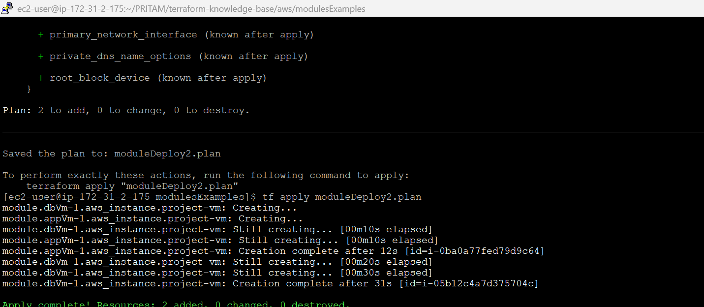
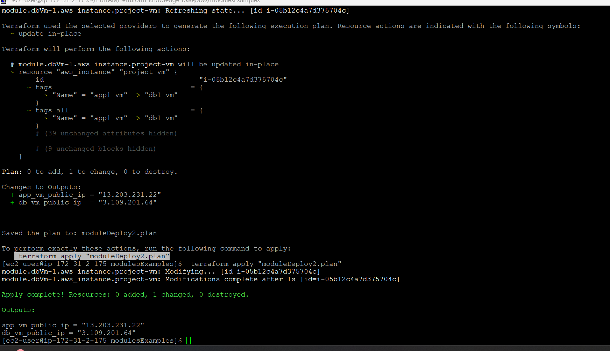

# AWS Modules Examples

This directory contains reusable Terraform modules for provisioning AWS resources, specifically designed for creating virtual machines and related infrastructure.

## Module Structure

### Files

- **main.tf**: This is the main configuration file that defines the AWS resources to be created. It typically includes the EC2 instance definitions and any associated resources.
- **output.tf**: This file specifies the outputs of the module, such as the public IP addresses of the created EC2 instances. Outputs are useful for referencing values in other modules or configurations.

- **provider.tf**: This file configures the AWS provider, specifying the region and credentials required to interact with AWS services. It may use variables defined in `var.tf`.

- **var.tf**: This file defines the input variables for the module, including AWS credentials, region, AMI IDs, instance types, and any other parameters necessary for resource creation.

- **imgs/**: This directory contains images or diagrams that illustrate the architecture or setup of the resources defined in this module.

## Usage

To use these modules in your Terraform configurations:

1. **Include the Module**: Reference the module in your Terraform configuration using the `module` block.

   ```hcl
   module "example" {
     source = "./modulesExamples"
     # Pass required variables here
   }
   ```

## Outputs

>[!CAUTION]
> Public IP not printing post creation
>
> 


>[!TIP]
> Public IP printing post alteration in script
>
> 
